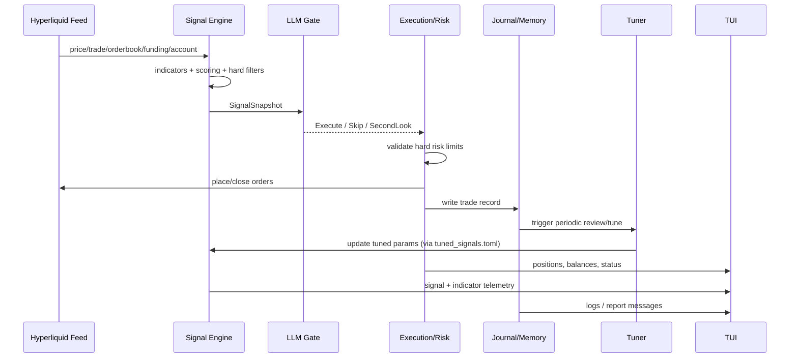

# openSigma

> Adaptive BTC perp scalping agent on Hyperliquid  
> **Signal Engine + LLM Gate + Live Tuning + Memory Loop**

---

## What openSigma Is

`openSigma` is a Rust-based, real-time BTC perpetuals trading agent designed for short-term execution.

It combines:

- deterministic market signals (EMA/RSI/CVD/OB/BB/VWAP/Regime/Delta Divergence),
- an LLM decision gate for execution quality,
- hard risk controls,
- and a self-improving memory/report/tuning loop.

The system is built for **fast iteration**, **clear observability (TUI + logs)**, and **modular signal evolution**.

---

## System Architecture

### 1) Layered Design View

```text
┌─────────────────────────────────────────────────────────────────────┐
│                        DATA INGESTION LAYER                         │
│  src/data/hyperliquid.rs + news.rs                                  │
│  - price / trades / orderbook / funding / account / candles         │
└───────────────────────────────┬─────────────────────────────────────┘
                                │ MarketEvent
                                ▼
┌─────────────────────────────────────────────────────────────────────┐
│                    SIGNAL ENGINE (DETERMINISTIC)                    │
│  src/signals/indicators.rs + aggregator.rs                          │
│  - feature calc (EMA/RSI/CVD/OB/BB/ATR/VWAP/Regime/DeltaDiv)        │
│  - score aggregation + hard filters + signal level classification   │
│  Output: SignalSnapshot { level, score, indicators, filter_reason } │
└───────────────────────────────┬─────────────────────────────────────┘
                                │ Snapshot + Memory + Portfolio
                                ▼
┌─────────────────────────────────────────────────────────────────────┐
│                        LLM DECISION LAYER                           │
│  src/agent/llm_gate.rs (+ llm_client.rs / second_look.rs)           │
│  - returns Execute / Skip / SecondLook                              │
│  - uses memory context and current risk/position state              │
└───────────────┬───────────────────────────────┬─────────────────────┘
                │ Execute                        │ Skip/SecondLook
                ▼                                ▼
┌─────────────────────────────────────────────────────────────────────┐
│                      EXECUTION + RISK LAYER                         │
│  src/execution/*.rs + main.rs orchestration                         │
│  - hard risk validation (non-overridable)                           │
│  - order placement, SL/TP, close confirmation, monitoring           │
│  - position lifecycle + kill switch                                 │
└───────────────────────────────┬─────────────────────────────────────┘
                                │ TradeRecord / Metrics
                                ▼
┌─────────────────────────────────────────────────────────────────────┐
│                      LEARNING + OBSERVABILITY                       │
│  journal/logger.rs, reporter.rs, memory.rs, tuner.rs, tui/app.rs    │
│  - journal.jsonl, reports, memory.md                                │
│  - param tuning -> data/tuned_signals.toml (feedback into signals)  │
│  - TUI + logs + telegram                                            │
└─────────────────────────────────────────────────────────────────────┘
```

### 2) Component Responsibilities


| Layer       | Main modules                        | Responsibility                                  | Output                      |
| ----------- | ----------------------------------- | ----------------------------------------------- | --------------------------- |
| Data        | `src/data`                          | normalize exchange/news streams                 | `MarketEvent`               |
| Signal      | `src/signals`                       | compute indicators + weighted scoring + filters | `SignalSnapshot`            |
| Decision    | `src/agent/llm_gate.rs`             | contextual trade decision                       | `Execute/Skip/SecondLook`   |
| Execution   | `src/execution` + `main.rs`         | risk check, place/close orders, track positions | fills + position events     |
| Learning    | `src/journal`, `src/agent/tuner.rs` | reporting, memory updates, param adaptation     | tuned params + memory rules |
| UI/Alerting | `src/tui`, `src/telegram.rs`        | operator visibility and notifications           | dashboard + alerts          |


### 3) Runtime Sequence (Design-Doc Style)




### 4) Architecture Notes

- `main.rs` is the orchestrator: owns event loop, wiring, and lifecycle transitions.
- `SignalSnapshot` is the contract between deterministic signals and LLM reasoning.
- `RiskChecker` is final authority; LLM output is always validated before execution.
- Learning loop is closed: journal -> report/memory -> tuner -> `tuned_signals.toml` -> next signals.

---

## Current Project Structure

```text
openSigma/
├── src/
│   ├── main.rs                     # runtime orchestration loop
│   ├── config.rs                   # config + secrets + tuned signal persistence
│   ├── types.rs                    # core domain types
│   ├── data/
│   │   ├── hyperliquid.rs          # market/account feed + historical fetch
│   │   └── news.rs                 # news circuit-breaker source (extensible)
│   ├── signals/
│   │   ├── candle_builder.rs       # 1m/5m bar construction
│   │   ├── indicators.rs           # EMA/RSI/Stoch/BB/ATR/CVD/VWAP/DeltaDiv
│   │   └── aggregator.rs           # scoring + hard filters + signal levels
│   ├── agent/
│   │   ├── llm_client.rs           # Claude client + retries/timeouts
│   │   ├── llm_gate.rs             # Execute/Skip/SecondLook decision gate
│   │   ├── second_look.rs          # delayed re-check scheduler
│   │   └── tuner.rs                # parameter tuning guardrails
│   ├── execution/
│   │   ├── hyperliquid.rs          # order placement / account queries
│   │   ├── position_monitor.rs     # active position state machine
│   │   ├── risk.rs                 # hard risk validation + equity tracking
│   │   └── kill_switch.rs          # drawdown emergency brake
│   ├── journal/
│   │   ├── logger.rs               # jsonl trade journal
│   │   ├── reporter.rs             # review reports + memory synthesis
│   │   └── memory.rs               # memory.md append/read API
│   ├── tui/
│   │   └── app.rs                  # terminal dashboard
│   └── telegram.rs                 # optional Telegram notifications
├── config.toml                     # base runtime config
├── data/
│   ├── tuned_signals.toml          # live learned signal params
│   ├── journal.jsonl               # machine-readable trade history
│   ├── reports/                    # markdown review reports
│   └── opensigma.log               # runtime logs
└── memory/
    └── memory.md                   # persistent learning narrative
```

---

## Signal Stack (Current)

### Core directional scoring

- EMA 9/21 cross
- RSI(14)
- Stoch RSI
- CVD level + CVD slope
- Order book imbalance (tiered)
- Funding bias
- Regime bias (`trend_up`, `trend_down`, `range`)
- VWAP deviation (mean-reversion + anti-chasing)
- **Delta Divergence** (price vs CVD confirmation)

### Signal levels

- `StrongLong`, `LeanLong`, `Weak`, `LeanShort`, `StrongShort`, `NoTrade`

### Risk filters (hard blocks)

- low ATR%
- funding in same direction too extreme
- kill switch / max daily loss
- news circuit breaker
- VWAP overextension anti-chasing filter

---

## Runtime Flow

1. Receive market/account events from Hyperliquid.
2. Build 1m/5m candles and indicator state.
3. Aggregate signals into a scored snapshot.
4. Pass snapshot + memory + portfolio context to LLM gate.
5. Validate decision with hard risk checker.
6. Execute orders, attach SL/TP, monitor positions.
7. Log every open/close into `data/journal.jsonl`.
8. Periodically run tune/report cycle:
  - tune params,
  - persist tuned params,
  - append findings to `memory/memory.md`.

---

## Quick Start

### 1) Environment

Create `.env` from `.env.example`, then set at minimum:

- `HL_PRIVATE_KEY`
- `ANTHROPIC_API_KEY`

Optional:

- `TELEGRAM_BOT_TOKEN`
- `TELEGRAM_CHAT_ID`

### 2) Configure

Edit:

- `config.toml` (capital, execution cadence, thresholds, tuning frequency)
- `data/tuned_signals.toml` (runtime-learned overrides; auto-updated by agent)

### 3) Run

```bash
cargo run
```

---

## Operator Notes

- `data/tuned_signals.toml` overrides `config.toml` signal defaults after startup load.
- TUI shows live indicators including funding, CVD delta, regime, VWAP deviation, and `ΔDiv`.
- `memory/memory.md` is the long-term learning trace used by the decision/tuning loop.
- `data/reports/*.md` are periodic review snapshots with condition-level outcomes.

---

## Safety + Scope

- This is a live-trading system. Start with small capital and validate behavior in your own environment.
- Not investment advice.

---

## openSigma Design Principles

- **Modular signals**: each new signal should be addable in 3 places only:
  1. `config` param,
  2. `indicators` detector,
  3. `aggregator` score integration.
- **Execution safety first**: exchange close confirmation before local state mutation.
- **Explainable learning**: memory/report entries include concrete indicator conditions.
- **Fast adaptation**: tune frequently, but with guardrails to avoid no-trade drift.

